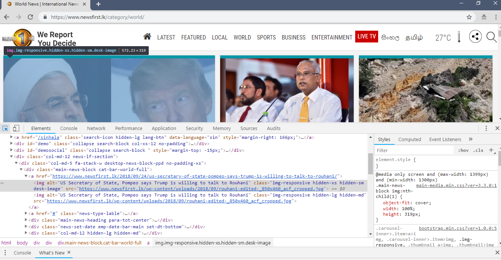

NewsFirst.lk Python Scrapper

This project is the sub project of a building a search index using a crawled webdata(Using Appache Solr).
First I analysed the newsFirst website and elements as below. 

Then the 5 spiders were developed to crawl all five categories listed in the website. These spiders not only go through the topics of the news and the key sentences of its but also it goes into the whole news article and crawls the whole content.

*How to run* 

1. Colne the project
2. Install scrapy 
    pip install scrapy
    
3.Go to the project directory/spiders

     scrapy crawl "spidername" -o "output_spdr1.json"
  
  (spidrenames are specified in the top of the spider files)
